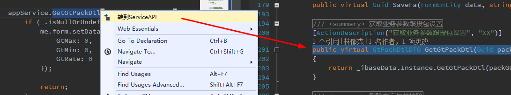
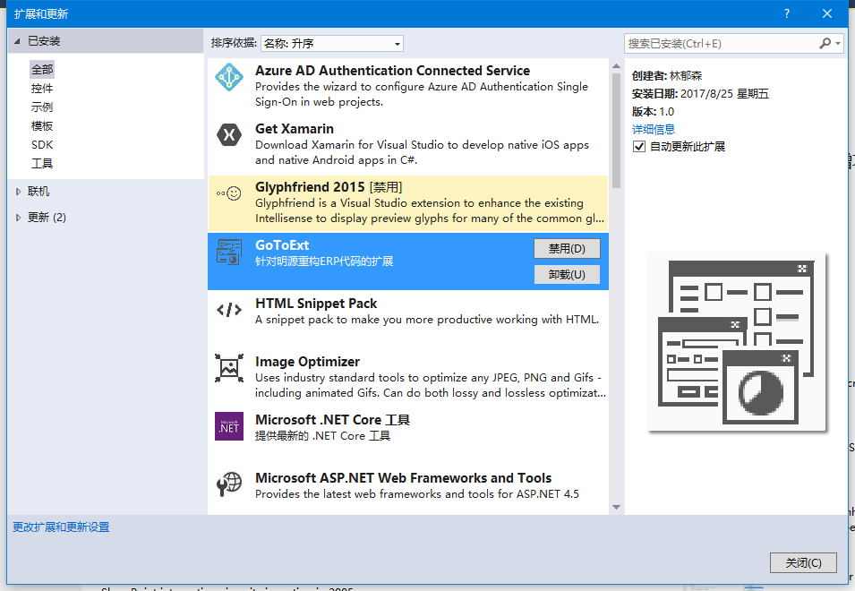

## 一些说明

> VS2015的插件，针对明源重构平台ERP代码的扩展

> 安装包地址：<https://raw.githubusercontent.com/linys2333/GoToExt/master/%E5%AE%89%E8%A3%85/GoToExt.vsix>

> 1、从js跳转到后端ServiceAPI定义

> 2、从XmlCommand跳转到SQL定义

> 禁用/卸载：打开VS2015 -> 工具 -> 扩展和更新 -> 找到GoToExt

