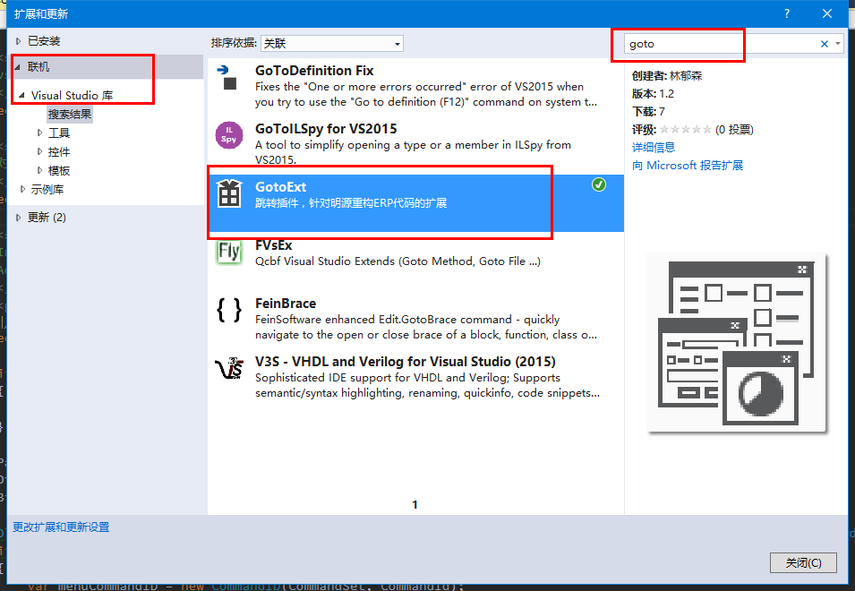

## 一些说明

> 项目升级到VS2017版本，未测试

> 跳转插件（GotoExt），基于VS2015开发，针对明源重构平台ERP代码的扩展。【[实现说明](http://note.youdao.com/noteshare?id=532cf20d57189dbaebff6a8afee69188)】

> 1、从js跳转到后端ServiceAPI定义

> 2、从XmlCommand跳转到SQL定义

> 安装：VS2015 -> 工具 -> 扩展和更新 -> 联机 -> 搜索“goto”关键字

> 禁用/卸载：VS2015 -> 工具 -> 扩展和更新 -> 已安装 -> 找到GotoExt

